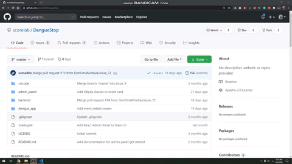
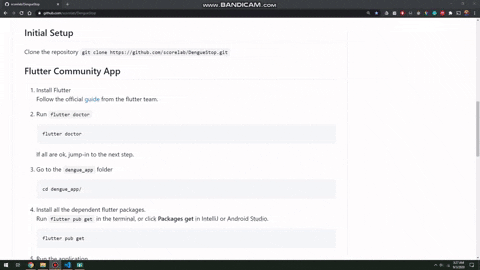
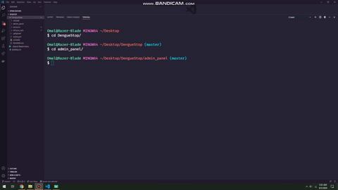
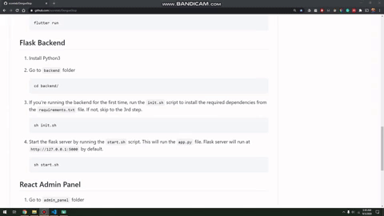
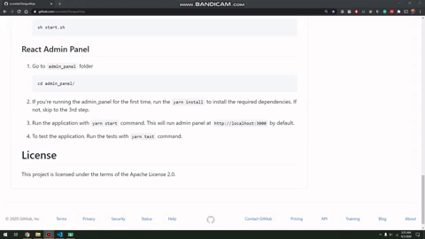

# Dengue-Stop

Dengue-Stop provides a simple and effective way to report and discover dengue incidents around your area, with the help of community.

# Installation

This instructions consist of 3 sections for Community Flutter App, Flask Backend and React Admin Panel respectively. Make sure to follow the initial setup before following each sections.

## Initial Setup

Clone the repository
`git clone https://github.com/scorelab/DengueStop.git`



## Flutter Community App



1. Install Flutter  
   Follow the official [guide](https://flutter.dev/docs/get-started/install) from the flutter team.

2. Run `flutter doctor`

    ```
    flutter doctor
    ```

    If all are ok, jump-in to the next step.

3. Go to the `dengue_app` folder

    ```
    cd dengue_app/
    ```

4. Install all the dependent flutter packages.  
   Run `flutter pub get` in the terminal, or click **Packages get** in IntelliJ or Android Studio.

    ```
    flutter pub get
    ```

5. Run the application.

    ```
    flutter run
    ```
#### Note - If the flutter application fails to connect to the local flask server, try the following command in the terminal
    adb reverse tcp:5000 tcp:5000
   
    
    
## Flask Backend



1. Install Python3

2. Go to `backend` folder

    ```
    cd backend/
    ```

3. If you're running the backend for the first time, run the `init.sh` script to install the required dependencies from the `requirements.txt` file. If not, skip to the 3rd step.

    ```
    sh init.sh
    ```

4. Start the flask server by running the `start.sh` script. This will run the `app.py` file. Flask server will run at `http://127.0.0.1:5000` by default.
    ```
    sh start.sh
    ```

## React Admin Panel



1. Go to `admin_panel` folder

    ```
    cd admin_panel/
    ```

2. If you're running the admin_panel for the first time, run the `yarn install` to install the required dependencies. If not, skip to the 3rd step.

3. Run the application with `yarn start` command. This will run admin panel at `http://localhost:3000` by default.

4. To test the application. Run the tests with `yarn test` command.

# License

This project is licensed under the terms of the Apache License 2.0.
